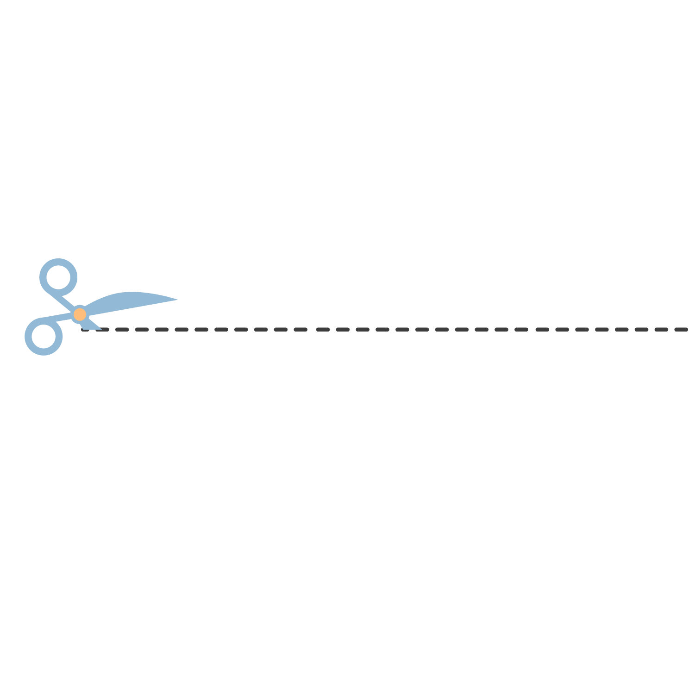
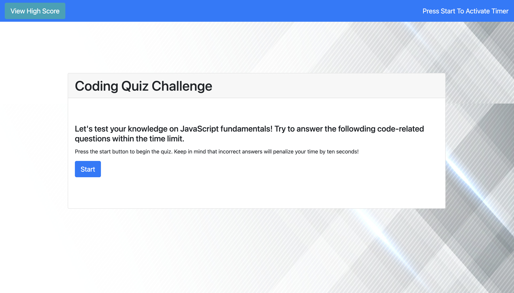
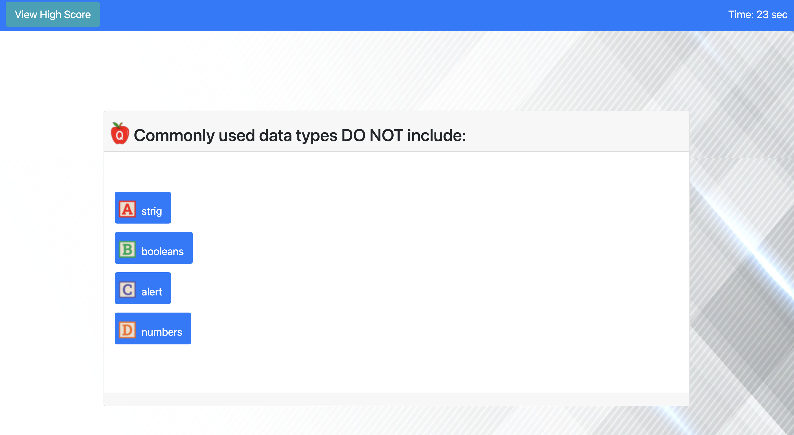
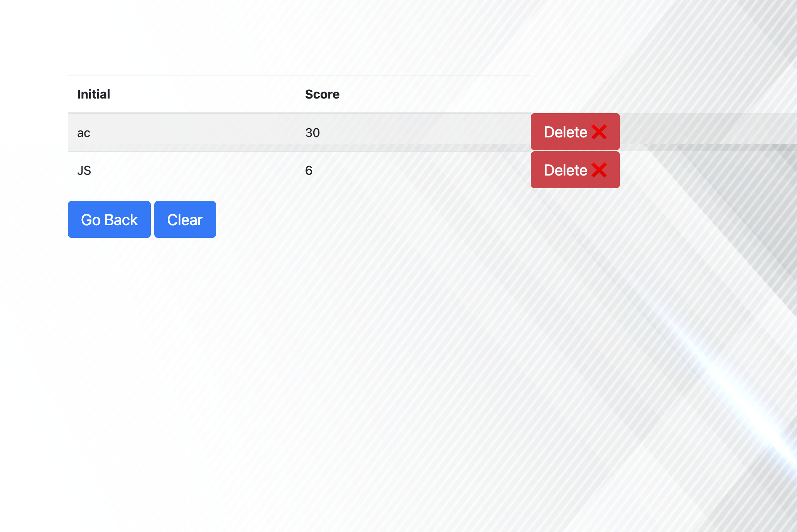
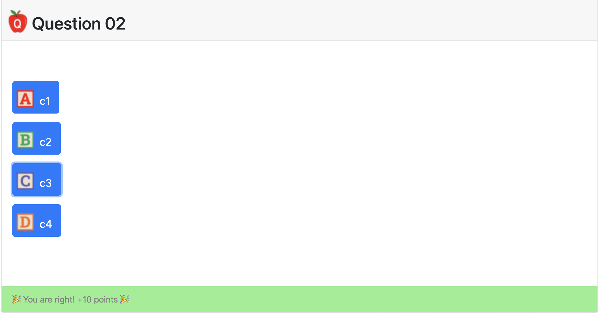
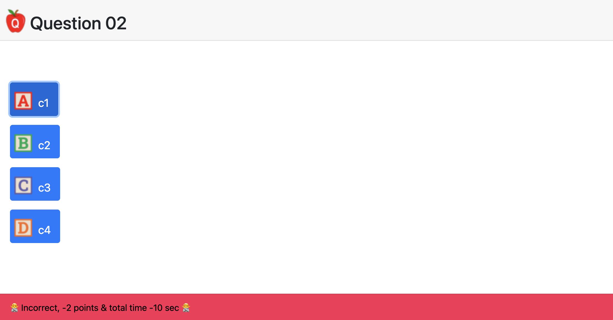
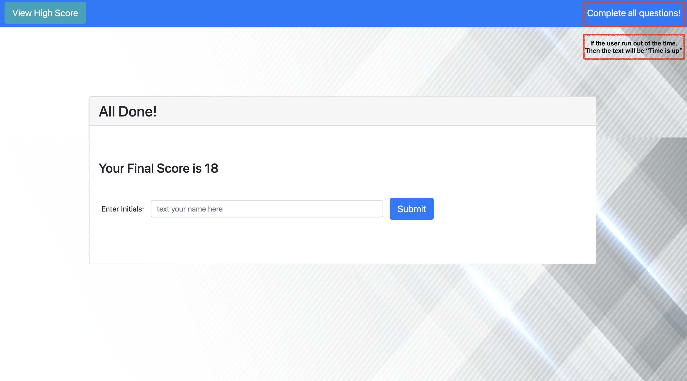

# Andrew(Sheng-Chu), Chou's Portfolio

## 🐳 Overview:
> * Code Quiz application using HTML, CSS(BootStrap), JavaScript
>
> * Submit / Clean the record, also allow user to delete the single record 
>
> * Local Storage to store the data

> **Note**: There is another js file called "questionCollectionObj.js", you can place your own questions set here. Remeber follow the format.
>

<p align="center">

</p>

## 🐯 Website URL:
❗❗❗ ☛ [Clik Me To The Page!](https://andrew-techmaster.github.io/Andrew-UWBootcamp-Challenge-04-Web-APIs-Code-Quiz/) ☚ ❗❗❗
```
https://andrew-techmaster.github.io/Andrew-UWBootcamp-Challenge-04-Web-APIs-Code-Quiz/
```

<p align="center">

</p>

## 🦊 How I Design 
- Four sections in the main elements
    - Menu (visible)
    - Quia (hidden -> visible)
    - Settle (hidden -> visible)
    - Score (hidden -> visible)
- Styles
    - Bootstrap card
    - Bootstrap button
    - Own customization
- Data Storage
    - JavaScript array in the local
    - JSON array in remote the (local storage)
    - addScore() function: add data in the local array
    - pushScore() function: push data to the remote (Serialize)
    - pullScore() function: get data from the remote (Deserialize)
    - printScore() function: render all data in the score section
- Question set
    - title: string
    - choice: string[ ]
    - answer: string (one of the item in the string[ ])
- Event Listener
    - View Score Button
    - Start Button (menu section)
    - Option Button (quiz section)
    - Submit Button (settle section)
    - Go Back & Clear Button (score section)
    - Delete Button (append in every record of the score section)

<p align="center">

</p>


## 🐼 Screenshots Of The Applications:

||
|:--:| 
| *Click start to begin the quiz* |

||
|:--:| 
| *Demo for one of the question* |

||
|:--:| 
| *Click "View High Score" button to diplay the rusult* |

### The following shows some of the application:
||
|:--:| 
| *When user select incorrect answer* |

||
|:--:| 
| *When user select right answer* |

||
|:--:| 
|*When users finish the quiz before time is up*|
- - -
© 2022 edX Boot Camps LLC. Confidential and Proprietary. All Rights Reserved.
